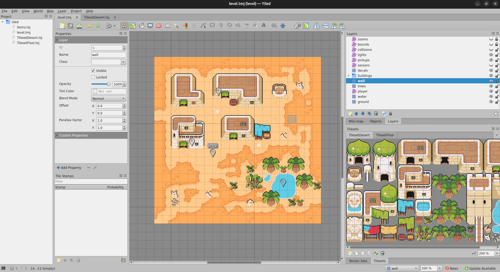
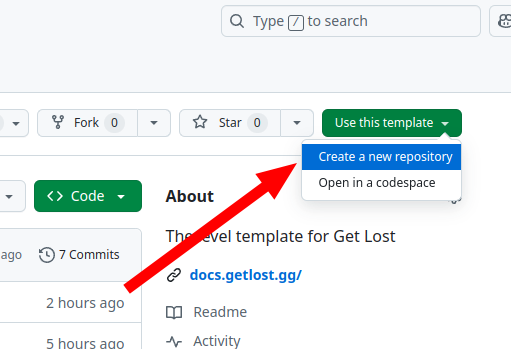
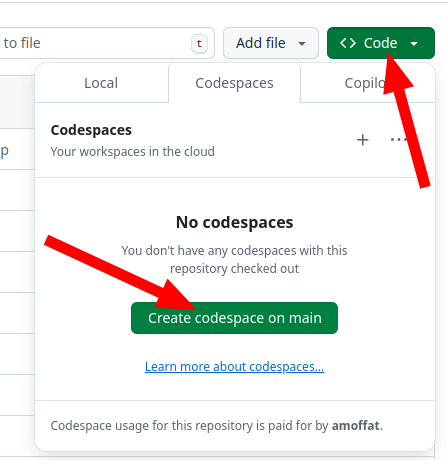
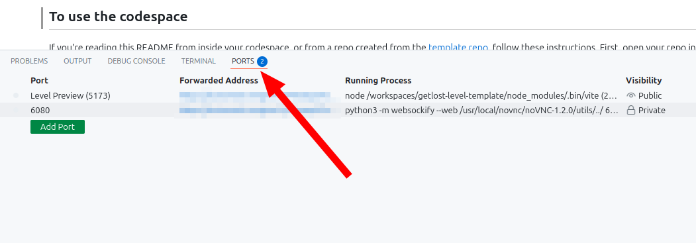
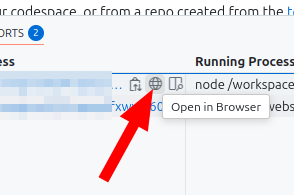

# 🏗️ Get Lost Level template

Welcome! This is a basic level template for the [Get Lost](https://x.com/GetLostTheGame) platform. It provides you with everything you need to start developing a level and play test it in the browser. Included is a small sample map built with the incredible [CC0](https://creativecommons.org/public-domain/cc0/) asset pack [Ninja Adventure](https://pixel-boy.itch.io/ninja-adventure-asset-pack) from the French game dev brothers [Pixel Boy](https://x.com/2Pblog1).

# 🔗 Quickstart links

- [Discord](https://discord.gg/v4AAezkSEu)
- [Full documentation](https://docs.getlost.gg/latest/)
- [Main level code](./level/code/main.ts)
- [Credits code](./level/code/card.ts)
- [Dialogue text](./level/code/strings.ts)

# To use this template

If you're reading this README directly from the `amoffat/getlost-level-template` template repo, scroll to the top of the page and click `Use this template` and select `Create a new repository`. This will create a new repository on your account using this repo as the template. Then proceed to the next section.

# Starting the codespace

On your personal copy of the repo (created from the previous step), go to `Code` and then `Open in a Codespace`. The Codespace will take a minute to fully load and open, but when it's done, you'll see a typical VSCode editor in the browser.

Next, navigate to the `ports` tab at the bottom of the editor. You'll see 2 ports, one for previewing your level (public port 5173) and one for editing your level (private port 6080)

If you hover over the `Forwarded Address` field, you have the option to open the ports in a new browser tab. Clicking port 5173 will let you play test the level in your browser, and clicking port 6080 will let you edit your level in the browser.

# Upgrading

To upgrade your level to use the latest Get Lost engine, press `ctrl+shift+b` and select `Upgrade Level`. This will copy your level code to a safe place, upgrade your repo to use the latest engine, and then put your level code back.

You may need to run `Dev Containers: Rebuild Container` from within VSCode, after the upgrade completes. This is because the upgrade may have changed how your devcontainer should start.

If you have any issues, ask in the Discord.
